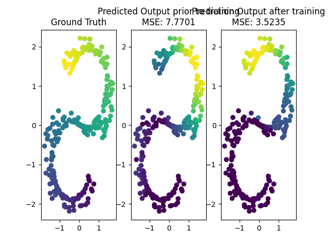

# CSCI Programming Assignment 5: Backpropagation
**Fall 2020**

## Utilities
`ArtificialNeuralNetwork` is initialized with by passing in an array of layer sizes. The first layer must be the same 
size as the input. So if `training_inputs.shape == (n_features, n_samples)` then the first layer will have to be set to
`n_features`. Similarly the output must be equal to the size of the output which in this lab will always be 1. 

The class has 2 function associated with it:
* `forward` which computes the output, intermediate activation, and pre-activation values at each layer
* `at_layer` which computes the forward pass upto the specified layer.

## Test Script
The test script is prepopulated with the rough configuration of what will be tested for grading, but 
**you should experiment** with changing the layers, number of epochs and learning rate all of these things can have a 
huge impact on your results. 

There are two tests, one is on randomly generated data points that have a large enough separation that the models 
should successfully learn a simple transformation that works and a synthetic dataset that represents a 3-D S shaped curve
as seen below:

